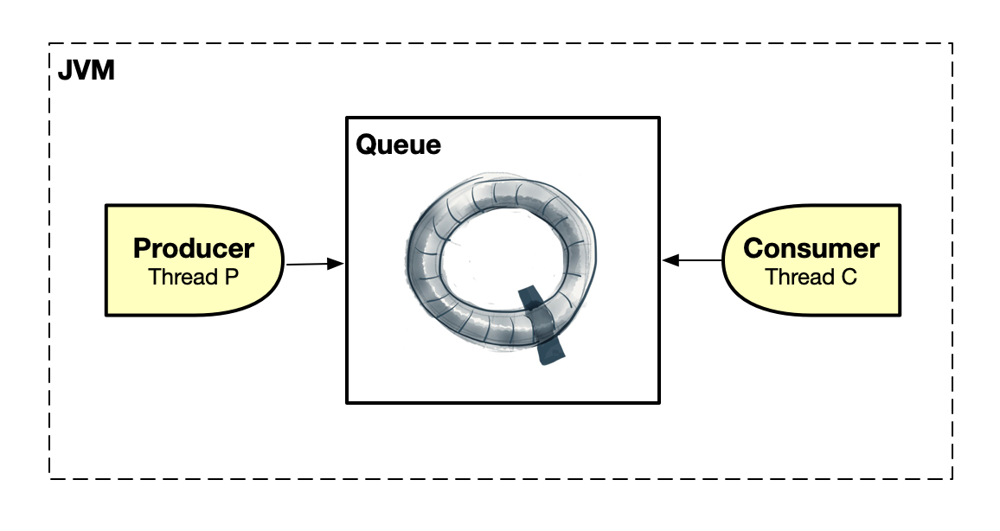
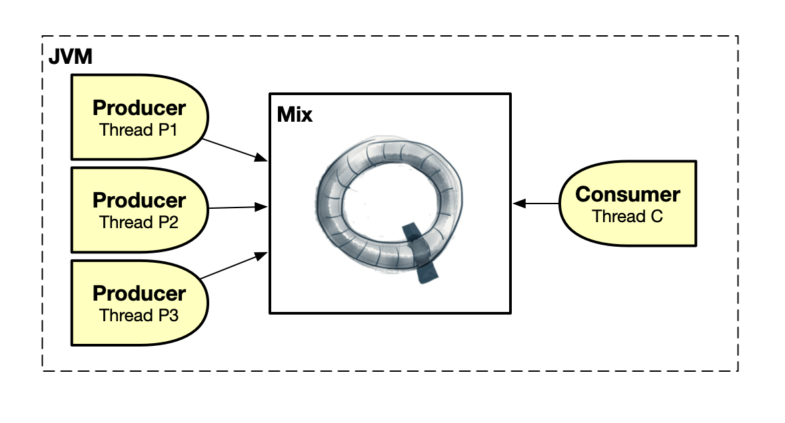
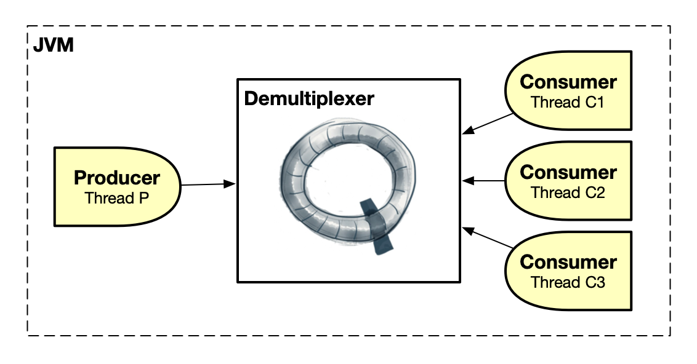
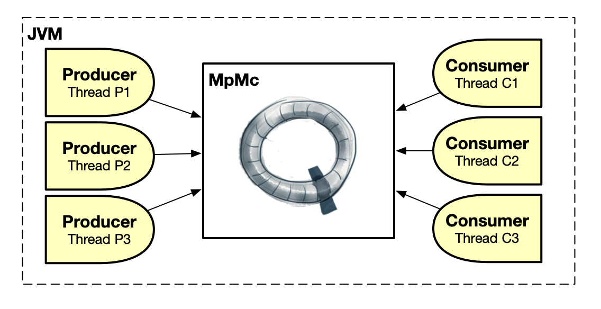
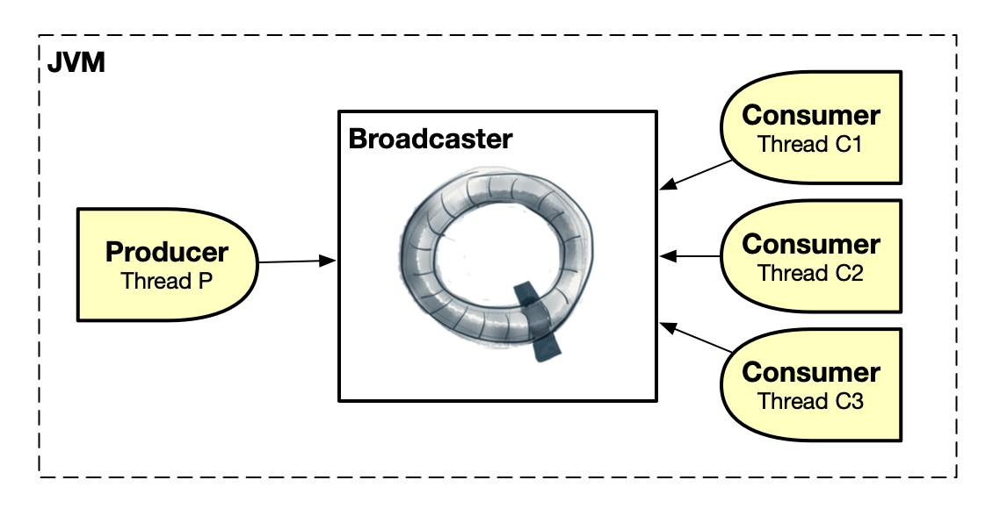
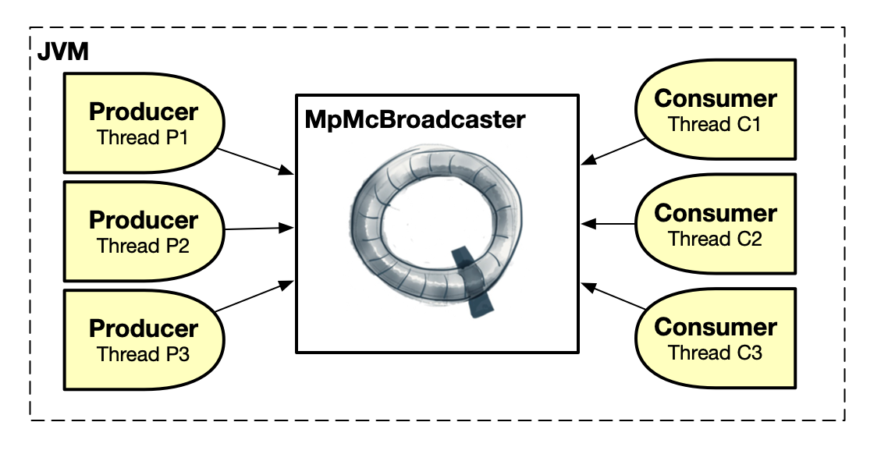
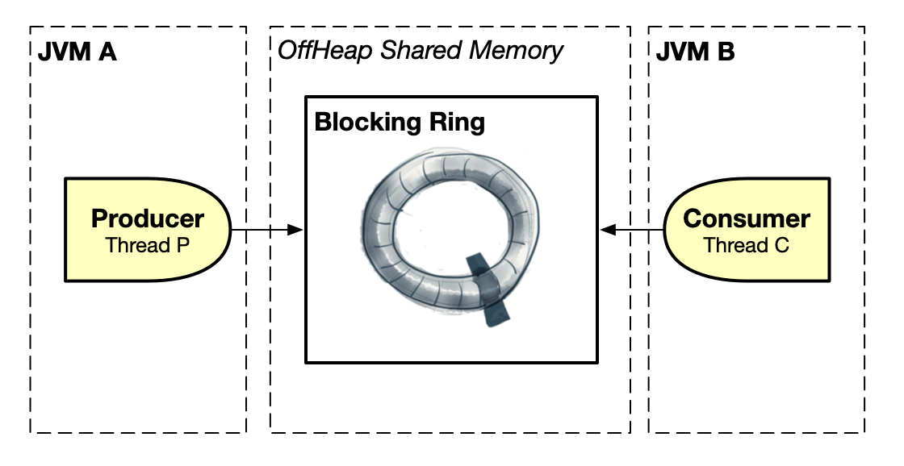

# CoralQueue
CoralQueue is an ultra-low-latency, lock-free, garbage-free, batching and concurrent collection of circular data structures for inter-thread communication in Java. It uses memory barriers through <a href="https://www.cs.umd.edu/~pugh/java/memoryModel/jsr-133-faq.html#volatile" target="_blank"><i>volatile</i> variables</a> instead of locks to allow Java threads (producers and consumers) to exchange messages as fast as possible. All data structures are circular and bounded, requiring producer/consumer blocking (but not locking) when they are full/empty through a wait strategy or busy spinning.

For some performance numbers you can check [this link](https://www.coralblocks.com/index.php/coralqueue-performance-numbers/).

The data structures are: [Queue](#queue) (one-producer-to-one-consumer), [Multiplexer](#multiplexer) (many-producers-to-one-consumer), [Demultiplexer](#demultiplexer) (one-producer-to-many-consumers), [MpMc](#mpmc) (many-producers-to-many-consumers), [Broadcaster](#broadcaster) (one-producer-to-many-consumers) and [MpMcBroadcaster](#mpmcbroadcaster) (many-producers-to-many-consumers).

## Queue



The Queue allows a single producer thread sending messages to the queue and a single consumer thread receiving messages from the queue, both running inside the same JVM. The consumer reads the messages (all the messages) in the same order that they were sent by the producer.

- Click [here](src/main/java/com/coralblocks/coralqueue/example/queue/Minimal.java) for a minimal example of using the Queue
- Click [here](src/main/java/com/coralblocks/coralqueue/example/queue/Basics.java) for a basic example of using the Queue

<details>
  <summary>Click here for all the details of how to use the Queue</summary>
  
### All about using the Queue

The queue is a circular data structure with pre-allocated <i> data transfer mutable objects</i>. You should see these data transfer mutable objects as <i>carriers of data</i>, in other words, they are there to allow
you to transfer <i>data</i> (and not object references) from producers to consumers. The steps are:

- A producer fetches an available data transfer mutable object from the queue
- The producer populates the mutable object with the data it wants to transfer (i.e. send) to the consumer(s)
- The producer flushes to notify the consumer(s)
- A consumer fetches an available data transfer mutable object from the queue
- The consumer reads the data from the mutable object
- The consumer calls <code>doneFetching()</code> to notify the producer(s)

Below we use a <code>StringBuilder</code> as our data transfer mutable object to create an <code>AtomicQueue</code>:
```Java
final Queue<StringBuilder> queue = new AtomicQueue<StringBuilder>(StringBuilder.class); // default queue capacity is 1024
```

You can also specify the capacity of the queue, which must be a power of two:
```Java
final Queue<StringBuilder> queue = new AtomicQueue<StringBuilder>(512, StringBuilder.class); // specifying the queue capacity
```
The code above creates a queue with 512 pre-allocated StringBuilders. Note that it uses the default constructor of StringBuilder which by default creates a StringBuilder with size 16. That may be too small for our data transfer objects as we don’t want the StringBuilder resizing itself during runtime and creating garbage. So to create a bigger StringBuilder we can use a <code>com.coralblocks.coralqueue.util.Builder</code> like below:
```Java
Builder<StringBuilder> builder = new Builder<StringBuilder>() {
    @Override
    public StringBuilder newInstance() {
        return new StringBuilder(1024);
    }
};
```

And pass this builder to the constructor of our <code>AtomicQueue</code>:
```Java
final Queue<StringBuilder> queue = new AtomicQueue<StringBuilder>(512, builder); // using a builder instead of the class
```

#### Sending messages to the queue

To send a message to the queue, you grab a data transfer mutable object from the queue, fill it with your data and call <code>flush()</code> as the code below illustrates:
```Java
StringBuilder sb;
while((sb = queue.nextToDispatch()) == null); // busy spin...
sb.setLength(0);
sb.append("Hello there!");
queue.flush();
```

Note that if the queue is full we just <i>busy spin</i> until a data transfer object becomes available. Later we will see how we can also use a <code>WaitStrategy</code> instead of busy spinning.

You can (and should) send messages in batches:
```Java
StringBuilder sb;
 
while((sb = queue.nextToDispatch()) == null); // busy spin...
sb.setLength(0);
sb.append("Hello there!");
 
while((sb = queue.nextToDispatch()) == null); // busy spin...
sb.setLength(0);
sb.append("Hello again!");
 
queue.flush();
```

#### Reading messages from the queue

To read messages from the queue you fetch them from a consumer thread, as the code below shows:
```Java
long avail;
while((avail = queue.availableToFetch()) == 0); // busy spin
for(int i = 0; i < avail; i++) {
    StringBuilder sb = queue.fetch();
    // do whatever you want with the StringBuilder
    // just do not create garbage
    // copy char by char if needed
    // or copy the contents to an external StringBuilder
}
queue.doneFetching();
```
Again we busy spin if the queue is empty. Later we will see how we can also use a <code>WaitStrategy</code> instead of busy spinning.

Note that we fetch in batches, reducing the number of times we have to check for an empty queue through <code>availableToFetch()</code>.

</details> 

<details>
  <summary>Click here for all the details of how to use Wait Strategies</summary>

### All about using Wait Strategies

By default, you should busy-spin when the queue is full or empty. That’s usually the fastest approach but not always the best as you might want to allow other threads to use the CPU core. CoralQueue comes with a variety of wait strategies that you can use instead of busy spinning, and you can also create your own by implementing the <code>WaitStrategy</code> interface. Below are some examples of wait strategies that come with CoralQueue:

- [ParkBackOffWaitStrategy](https://github.com/coralblocks/CoralQueue/blob/main/src/main/java/com/coralblocks/coralqueue/waitstrategy/ParkBackOffWaitStrategy.java): park (i.e. sleep) for 1 microsecond backing off up to a maximum of 1 millisecond in steps of 1 microsecond. The start, max and step values can be configured.
- [BusySpinParkBackOffWaitStrategy](https://github.com/coralblocks/CoralQueue/blob/main/src/main/java/com/coralblocks/coralqueue/waitstrategy/BusySpinParkBackOffWaitStrategy.java): first busy spins for 10,000,000 cycles then it starts to park (i.e. sleep) by using the ParkBackOffWaitStrategy above. This is an example of a composite wait strategy, which combines multiple wait stratgies in a single one. The number of busy-spin cycles can be configured.
- [BusySpinYieldSleepWaitStrategy](https://github.com/coralblocks/CoralQueue/blob/main/src/main/java/com/coralblocks/coralqueue/waitstrategy/BusySpinYieldSleepWaitStrategy.java): busy spins for 10,000,000 cycles, yields for 100 cycles then starts to sleep for 1 millisecond. All previous values can be changed/configured.

To use a wait strategy, all you have to do is call its <code>block()</code> and <code>reset()</code> methods instead of busy spinning:

#### Producer using a Wait Strategy <i>(without batching)</i>
```Java
WaitStrategy producerWaitStrategy = new ParkWaitStrategy();
StringBuilder sb;
while((sb = queue.nextToDispatch()) == null) {
    producerWaitStrategy.block(); // <=====
}
sb.setLength(0);
sb.append("Hello there!");
queue.flush();
producerWaitStrategy.reset(); // <=====
```

#### Producer using a Wait Strategy <i>(with batching)</i>
```Java
WaitStrategy producerWaitStrategy = new ParkWaitStrategy();
StringBuilder sb;

while((sb = queue.nextToDispatch()) == null) {
    producerWaitStrategy.block(); // <=====
}
producerWaitStrategy.reset(); // <=====
sb.setLength(0);
sb.append("Hello there!");

while((sb = queue.nextToDispatch()) == null) {
    producerWaitStrategy.block(); // <=====
}
producerWaitStrategy.reset(); // <=====
sb.setLength(0);
sb.append("Hello again!");

queue.flush();
```

#### Consumer using a Wait Strategy
```Java
WaitStrategy consumerWaitStrategy = new BusySpinYieldSleepWaitStrategy();
long avail;
while((avail = queue.availableToFetch()) == 0) {
    consumerWaitStrategy.block(); // <=====
}
for(int i = 0; i < avail; i++) {
    StringBuilder sb = queue.fetch();
    // do whatever you want with the StringBuilder
    // just do not create garbage
    // copy char by char if needed
    // or copy the contents to an external StringBuilder
}
queue.doneFetching();
consumerWaitStrategy.reset(); // <=====
```
</details>

<details>
  <summary>Click here for all the details of how to use Semi-Volatile Writes</summary>

### All about using Semi-Volatile Writes (lazySet)

To squeeze every bit of performance out of CoralQueue, you can use <i>semi-volatile writes</i> when sending and receiving messages. Basically, a semi-volatile write is done through the <code>lazySet</code> method from <code>java.util.concurrent.AtomicLong</code>. It is a faster operation for the thread that’s modifying the variable at the expense of the thread that’s interested in knowing about updates in the variable. For example, if you want to minimize the latency in the producer, you should use lazySet. On the other hand, if you want to minimize the message transit time, you should not use lazySet so the consumer is notified as soon as possible about a new message in the queue.

By default, CoralQueue does not use <code>lazySet</code>, in other words the other thread is notified immediately (or as soon as possible). But you can easily take control of that by using the methods below:
```Java
// producer notifying consumer(s)
queue.flush(); // no lazySet by default (notify the consumer thread immediately at the expense of the producer thread)
queue.flush(true); // use lazySet (take more time to notify the consumer thread in order not to introduce any latency to the producer thread)
```
```Java
// consumer notifying producer(s)
queue.doneFetching(); // no lazySet by default (notify the producer thread immediately at the expense of the consumer thread)
queue.doneFetching(true); // use lazySet (take more time to notify the producer thread in order not to introduce any latency to the consumer thread)
```
</details>
  
## Multiplexer



The Multiplexer allows multiple producer threads sending messages to the multiplexer and a single consumer thread receiving messages (all the messages) from the multiplexer, all running inside the same JVM.
The order that the consumer will process the messages is of course undetermined due to the simultaneous producers.

- Click [here](src/main/java/com/coralblocks/coralqueue/example/multiplexer/Minimal.java) for a minimal example of using the Multiplexer
- Click [here](src/main/java/com/coralblocks/coralqueue/example/multiplexer/Basics.java) for a basic example of using the Multiplexer

## Demultiplexer



The Demultiplexer allows a single producer thread sending messages to the demultiplexer and multiple consumer threads receiving messages from the demultiplexer, all running inside the same JVM. `Note that messages are not duplicated by the demultiplexer.` They are distributed among the consumer threads, in other words, a message is processed only once by one of the consumers. `Also note that the order that the consumers will process the messages is undetermined.`

- Click [here](src/main/java/com/coralblocks/coralqueue/example/demultiplexer/Minimal.java) for a minimal example of using the Demultiplexer
- Click [here](src/main/java/com/coralblocks/coralqueue/example/demultiplexer/Basics.java) for a basic example of using the Demultiplexer

## MpMc



The MpMc (i.e. Multiple Producers / Multiple Consumers) allows multiple producer threads sending messages to the mpmc and multiple consumer threads receiving messages from the mpmc, all running inside the same JVM. `Note that messages are not duplicated by the mpmc.` They are distributed among the consumer threads, in other words, a message is processed only once by one of the consumers. `Also note that the order that the consumers will process the messages is of course undetermined.`

- Click [here](src/main/java/com/coralblocks/coralqueue/example/mpmc/Minimal.java) for a minimal example of using the MpMc
- Click [here](src/main/java/com/coralblocks/coralqueue/example/mpmc/Basics.java) for a basic example of using the MpMc

## Broadcaster



The Broadcaster allows a single producer thread sending messages to the broadcaster and multiple consumer threads receiving messages from the broadcaster, all running inside the same JVM. `Note that all consumers receive all messages.` `The consumer threads read the messages in the same order that they were sent by the single producer.`

- Click [here](src/main/java/com/coralblocks/coralqueue/example/broadcaster/Minimal.java) for a minimal example of using the Broadcaster
- Click [here](src/main/java/com/coralblocks/coralqueue/example/broadcaster/Basics.java) for a basic example of using the Broadcaster

## MpMcBroadcaster



The MpMcBroadcaster (i.e. Multiple Producers / Multiple Consumers) allows multiple producer threads sending messages to the mpmc broadcaster and multiple consumer threads receiving messages from the mpmc broadcaster, all running inside the same JVM. `Note that all consumers receive all messages.` `Also note that the order that the consumers will process the messages is of course undetermined due to the simultaneous producers.`

- Click [here](src/main/java/com/coralblocks/coralqueue/example/mpmcbroadcaster/Minimal.java) for a minimal example of using the MpMcBroadcaster
- Click [here](src/main/java/com/coralblocks/coralqueue/example/mpmcbroadcaster/Basics.java) for a basic example of using the MpMcBroadcaster

## CoralRing



CoralQueue is great for threads inside the same JVM. But how about threads running in _different JVMs_? For that you can check our [CoralRing](https://github.com/coralblocks/CoralRing) project which is an inter-process communication (IPC) shared-memory ring with blocking and non-blocking producers and consumers.
