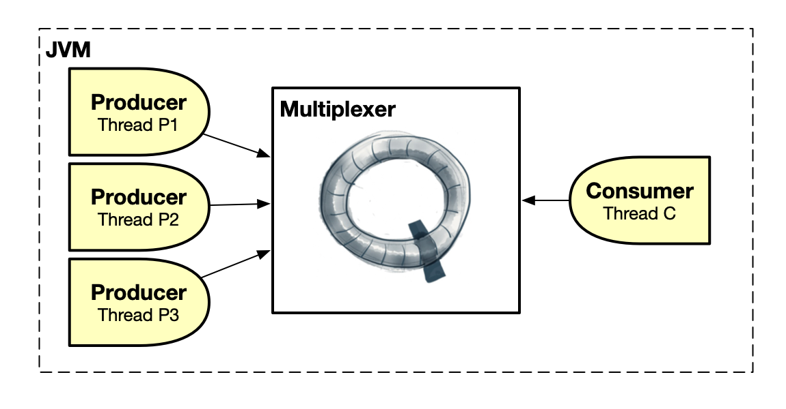

# CoralQueue
CoralQueue is a ultra-low-latency, lock-free, garbage-free, batching and concurrent collection of circular data structures for inter-thread communication in Java. It uses memory barriers instead of locks to allow Java threads (producers and consumers) to exchange messages as fast as possible. All data structures are circular and bounded requiring producer/consumer blocking through a wait strategy when they are full/empty.

For some performance numbers you can check [this link](https://www.coralblocks.com/index.php/coralqueue-performance-numbers/).

The data structures are: [Queue](#queue) (one-producer-to-one-consumer), [Multiplexer](#multiplexer) (many-producers-to-one-consumer), [Demultiplexer](#demultiplexer) (one-producer-to-many-consumers), [MpMc](#mpmc) (many-producers-to-many-consumers), [Broadcaster](#broadcaster) (one-producer-to-many-consumers) and [MpMcBroadcaster](#mpmcbroadcaster) (many-producers-to-many-consumers).

## Queue

The Queue allows a single producer thread sending messages to the queue and a single consumer thread receiving messages from the queue, both running inside the same JVM. The consumer reads the messages in the same order that they were sent by the producer.

## Multiplexer

The Multiplexer allows multiple producer threads sending messages to the multiplexer and a single consumer thread receiving messages from the multiplexer, all running inside the same JVM.

## Demultiplexer

The Demultiplexer allows a single producer thread sending messages to the demultiplexer and multiple consumer threads receiving messages from the demultiplexer, all running inside the same JVM. `Note that messages are not duplicated by the demultiplexer.` They are distributed among the consumer threads, in other words, a message is processed only once by one of the consumers. `Also note that the order that the consumers will process the messages is undetermined.`

## MpMc

The MpMc (i.e. Multiple Producers / Multiple Consumers) allows multiple producer threads sending messages to the mpmc and multiple consumer threads receiving messages from the mpmc, all running inside the same JVM. `Note that messages are not duplicated by the mpmc.` They are distributed among the consumer threads, in other words, a message is processed only once by one of the consumers. `Also note that the order that the consumers will process the messages is of course undetermined.`

## Broadcaster

The Broadcaster allows a single producer thread sending messages to the broadcaster and multiple consumer threads receiving messages from the broadcaster, all running inside the same JVM. `Note that all consumers receive all messages.` `The consumer threads read the messages in the same order that they were sent by the single producer.`

## MpMcBroadcaster

The MpMcBroadcaster (i.e. Multiple Producers / Multiple Consumers) allows multiple producer threads sending messages to the mpmc broadcaster and multiple consumer threads receiving messages from the mpmc broadcaster, all running inside the same JVM. `Note that all consumers receive all messages.` `Also note that the order that the consumers will process the messages is of course undetermined due to the simulaneous producers.`

